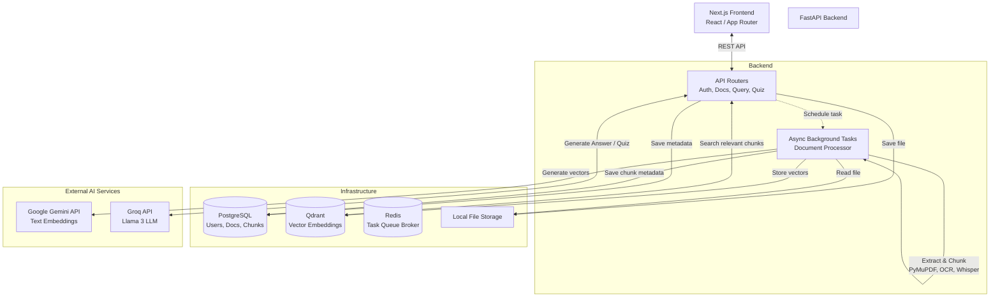

# KB Agent

A local-first, full-stack Knowledge Base Agent. Upload documents (PDFs, images, videos, audio), process them into searchable vector embeddings, and interact with them via AI-powered Q&A chat and automatic Quiz generation.

## 🚀 Features

- **Multi-modal Document Processing**: Supports PDF text, Tesseract OCR for images, and local Whisper transcription for video/audio.
- **RAG QA Chat**: Ask questions across your documents with citations to original source chunks.
- **AI Quiz Generator**: Generate dynamically structured Multiple Choice, True/False, or Short Answer quizzes based on selected documents.
- **Privacy-First**: Vector storage (Qdrant), Relational Data (PostgreSQL), and Task Queues (Redis) run completely locally via Docker.
- **Free-Tier Optimized AI**: Configured out-of-the-box to use **Google Gemini** for free embeddings and **Groq (Llama 3)** for free lightning-fast LLM inferences.

---

## 🏗️ Architecture



---

## 🛠️ Technology Stack

- **Frontend**: Next.js 14, React, scoped CSS (Dark mode).
- **Backend**: Python, FastAPI, SQLAlchemy (Async), Alembic, python-jose (JWT Auth)
- **Document Processing**: PyMuPDF (PDF), pytesseract (Images), openai-whisper (Audio/Video), sentence-transformers chunking.
- **Databases**: PostgreSQL (Relational), Qdrant (Vector), Redis (Queue/Broker).
- **AI Models**: Google Gemini (`gemini-embedding-001`), Groq (`llama-3.3-70b-versatile`).

---

## 🏁 Getting Started

### 1. Prerequisites
- Docker Desktop
- Python 3.10+
- Node.js 18+
- [Groq API Key](https://console.groq.com) (Free)
- [Google Gemini API Key](https://aistudio.google.com) (Free)

### 2. Environment Setup
Fill in the API keys in your `.env` file at the root.

```env
GROQ_API_KEY=gsk_your_groq_key
GEMINI_API_KEY=AIzaSy_your_gemini_key
```

### 3. Start Infrastructure
Run the local databases and vector store via Docker:
```bash
docker compose up -d
```

### 4. Setup Backend
```bash
cd backend
python -m venv venv
source venv/Scripts/activate  # Windows
pip install -r requirements.txt

# Run database migrations
alembic upgrade head

# Start API server
uvicorn app.main:app --reload --port 8000
```

### 5. Setup Frontend
In a new terminal:
```bash
cd frontend
npm install
npm run dev
```

Navigate to `http://localhost:3000` to register, log in, and start building your knowledge base!

---

## 📂 Directory Structure

```text
KB_Agent/
├── docker-compose.yml       # Infrastructure orchestration
├── .env                     # Global secrets and configuration
├── backend/
│   ├── alembic/             # Postgres Schema migrations
│   ├── app/                 
│   │   ├── routers/         # API endpoints (auth, documents, etc.)
│   │   ├── services/        # Business logic & LLM integrations
│   │   ├── tasks/           # Async document processing pipeline
│   │   └── models/          # SQLAlchemy ORM definitions
│   └── storage/             # Locally uploaded user files
└── frontend/
    ├── src/
    │   ├── app/             # Next.js pages (dashboard, chat, quiz)
    │   ├── lib/             # API connection client
    │   └── styles/          # Scoped application CSS
    └── public/              # Static assets
```
